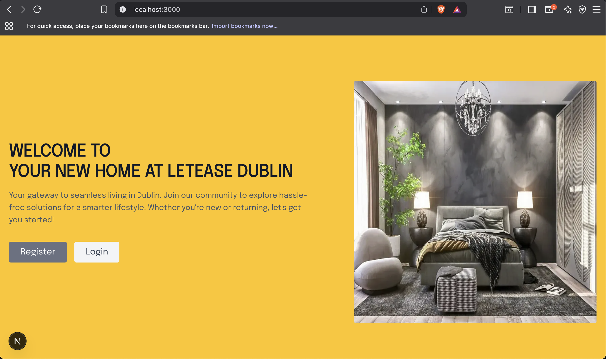
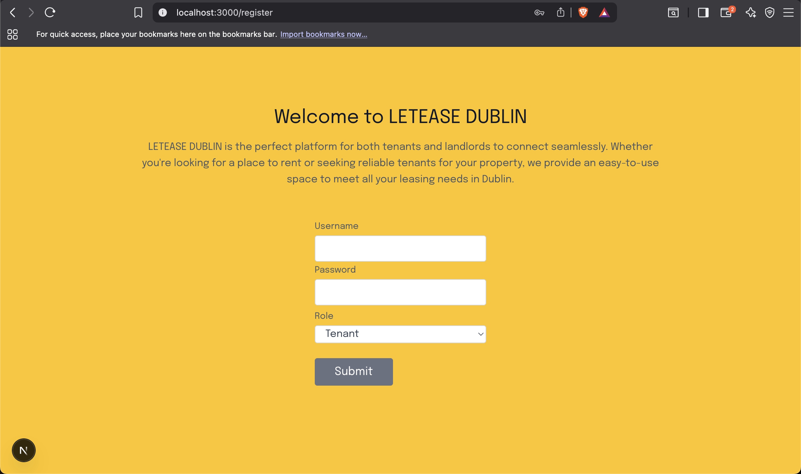
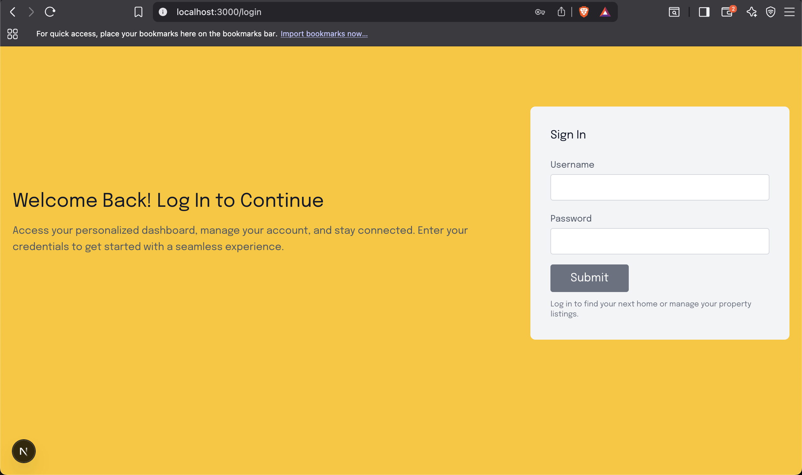

# Property Letting Platform

A full-stack property letting system built with Next.js, MySQL, and NextAuth supporting role-based access for admins, landlords, and users to manage, list, and apply for properties.

---

## Features

### Role-Based System
- **Admin**
  - Manage users and applications
  - Full system control and oversight

- **Landlord / Property Owner**
  - Add and manage property listings
  - View applications for their properties

- **User / Tenant**
  - Browse listings
  - Apply for properties
  - Track applications

---

### Core Features
- Property listing system with detailed views
- Application system for rentals
- User authentication with NextAuth
- Role-based dashboards (admin, user, landlord)
- User and property management panels
- MySQL-backed relational database

---

## Screenshots

A glimpse into the platform UI and user experience:

### Landing Page


### Register Page


### Login Page


---

## Tech Stack

| Layer | Technology |
|------|------------|
| Framework | Next.js (Pages Router) |
| Backend | Node.js (API Routes) |
| Authentication | NextAuth.js |
| Database | MySQL |
| Styling | CSS (global styles) |
| State/API | REST APIs via Next.js API routes |

---

## Project Structure

```

Property-Letting/
├── lib/                      # Database connection (db.js)
├── pages/
│   ├── api/                  # Backend API routes
│   │   ├── applications/    # Application management APIs
│   │   ├── auth/            # NextAuth configuration
│   │   ├── properties/     # Property APIs
│   │   ├── users/          # User management APIs
│   │   ├── register.js     # Registration endpoint
│   ├── dashboard.js         # Main dashboard
│   ├── listings.js          # Property listings
│   ├── login.js             # Login page
│   ├── register.js          # Register page
│   ├── apply.js             # Property application page
│   ├── my-applications.js   # User applications
│   ├── my-properties.js     # Landlord properties
│   ├── manage-apps.js       # Admin applications panel
│   ├── manage-users.js      # Admin user management
│   ├── logout.js            # Logout handler
│   ├── index.js             # Home page
├── public/
│   ├── images/              # UI images & screenshots
├── styles/
│   └── globals.css
├── property_letting.sql     # Database schema
├── next.config.mjs
├── package.json
└── jsconfig.json

````

---

## Getting Started

### Prerequisites
- Node.js v18+
- MySQL installed and running
- Environment variables configured

---

### Installation

```bash
# Clone the repository
git clone https://github.com/TahseenLabs/Property-Letting.git
cd Property-Letting

# Install dependencies
npm install

# Configure environment variables
cp .env.example .env.local

# Import database
mysql -u root -p < property_letting.sql

# Run development server
npm run dev
````

Open:

```
http://localhost:3000
```

---

## Environment Variables

Create a `.env.local` file:

```env
DB_HOST=localhost
DB_PORT=3306
DB_USER=your_user
DB_PASSWORD=your_password
DB_NAME=property_letting

NEXTAUTH_SECRET=your_secret
NEXTAUTH_URL=http://localhost:3000
```

---

## Database Setup

Import the schema:

```bash
mysql -u root -p < property_letting.sql
```

---

## Available Scripts

```bash
npm run dev      # Development server
npm run build    # Production build
npm run start    # Start production server
npm run lint     # Lint project
```

---

## Project Highlights

* Modular API structure (users, properties, applications)
* Role-based access control system
* Full CRUD operations for listings and applications
* Clean separation of frontend and backend logic
* Scalable MySQL schema design

---

<p align="center">
Built with ❤️ by <a href="https://github.com/TahseenLabs">TahseenLabs</a>
</p>

